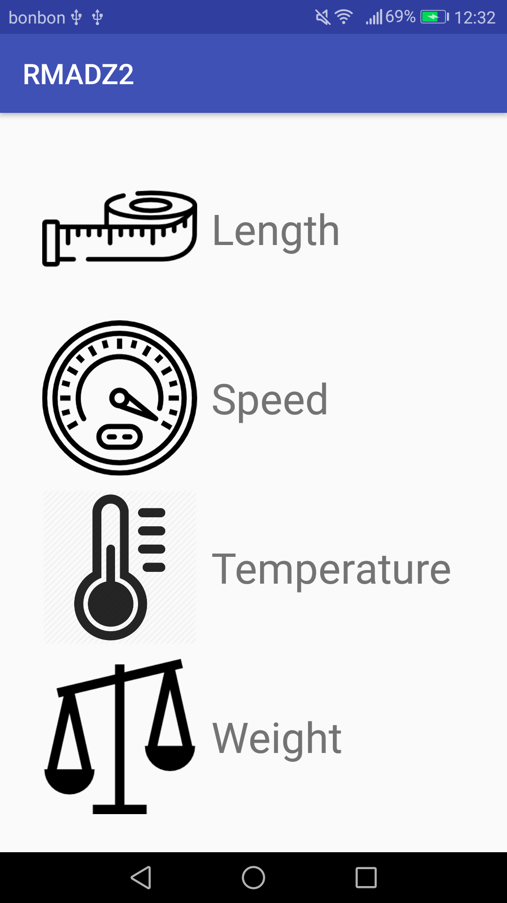
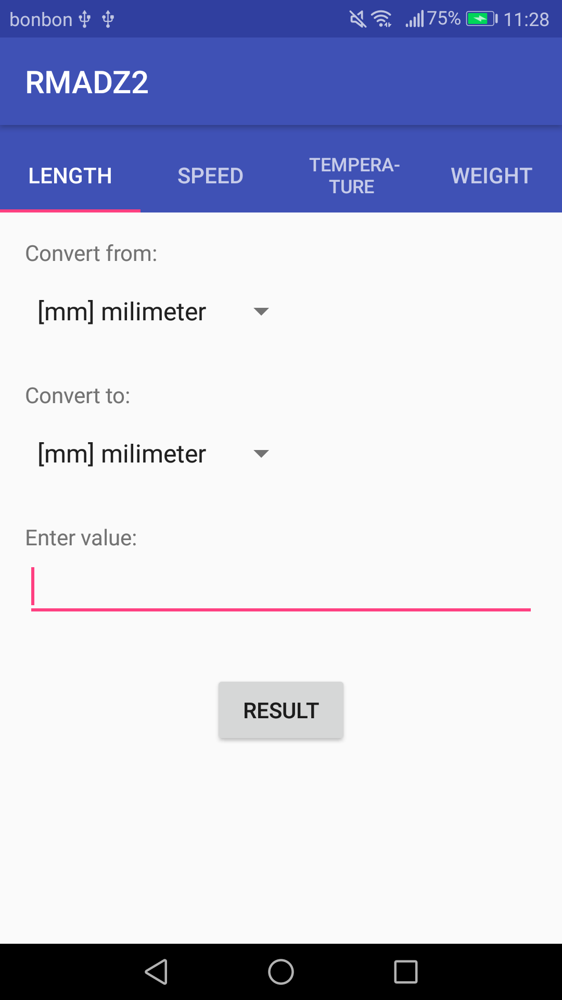
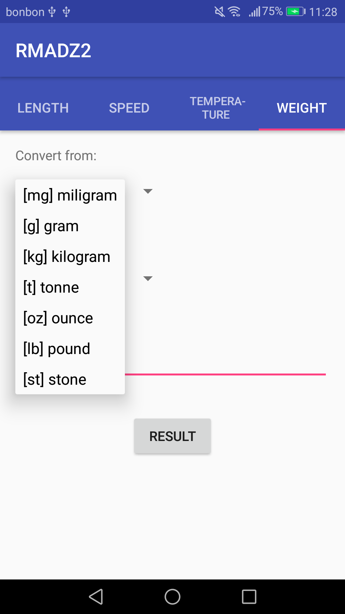
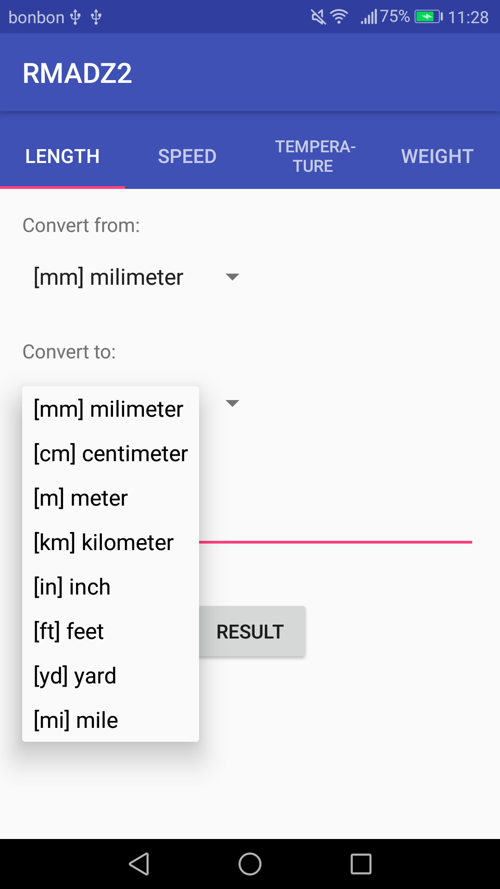
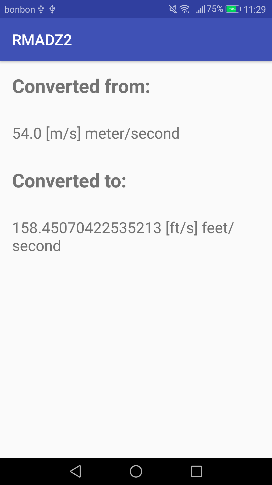

# RMA - DZ 2

## UniCon 


**Aplikacija za konverziju mjernih jedinica.**

## Zadatak i rješenje

"Potrebno je kreirati aplikaciju za konverziju mjernih jedinica. Aplikacija se sastoji
iz četiri Activitya. Prvi sadrži gumbe sa slikama koji opisuju o kojem je pretvaranju
riječ (npr. Temperatura, Udaljenost...). Klik na gumb eksplicitnim Intentom pokreće
Activity za željenu konverziju. U svakom od Activitya za konverziju potrebno je prikupiti
korisnički unos vrijednosti, tip jedinice u kojoj je unešeno (koristiti spinner) i izračunati
rezultat koji se zatim šalje u Activity namjenjen prikazu rezultata korištenjem extra
podataka."

Aplikacija je realizirana pomoću 3 activitya, a početni je  *MenuActivity* u kojem je moguće odabrati željenu konverziju. Time se pokreće *MainActivity* koji sadrži **fragmente** za svaku pojedinu konverziju, a koje je moguće izmjenjivati (listanjem) unutar *TabLayouta*. Klikom na **Button** se pokreće *ResultActivity* u kojemu se ispisuje rezultat konverzije. 

### Korištene vanjske biblioteke

* [ButterKnife](http://jakewharton.github.io/butterknife/) 

```gradle
implementation 'com.jakewharton:butterknife:8.8.1'
annotationProcessor 'com.jakewharton:butterknife-compiler:8.8.1'
```


### Screenshots











### Specifični dijelovi koda

* **Fragmenti**

Za prikaz fragmenata je definirano njihovo sučelje unutar *fragment_main.xml* te je kreirana klasa unutar *MainActivity*a. Sučelje se napuhuje koristeći *LayoutInflater*a, a smješteno je unutar *TabLayout*a te se pomoću *ViewPager*a omogućuje listanje između fragmenata. Ovisno koji je fragment odabran, postavljaju se vrijednosti *spinner*a te se klikom na gumb pokreće klasa *Conversions*. 

* **Konverzija**

Za konverziju je korištena posebna klasa *Conversions* koja sadrži sve metode za pojedine konverzije. Za pretvorbu duljine, brzine i težine su korišteni određeni faktori kako bi se jedinica prvo prebacila u metre, metre po sekundi te kilogram. Zatim se iz tih jedinica vrši konverzija u odabranu jedinicu. Ti faktori su sadržani u dolje navedenim poljima brojeva. 

```java
 private final static double[] LENGTH_FACTORS = {0.001, 0.01, 1, 1000, 0.0254, 0.3048, 0.9144, 1609.344}; //from unit to meter
    private final static double[] SPEED_FACTORS = {0.1, 1, 0.2778, 0.3408,  0.4770,  0.5144}; //from unit to m/s
    private final static double[] WEIGHT_FACTORS = {0.000001, 0.001, 1, 1000, 0.028495, 0.45359237, 6.35029}; //from unit to kilogram
```
Polja se zatim koriste u metodama za pretvorbu na način da se unešena vrijednost prvo pomnoži s odgovarajućim faktorom (faktorom za jedinicu iz koje se pretvara), a zatim podijeli s faktorom za jedinicu u koju se pretvara. 

```java
public static double convertLength(int sFromPosition, int sToPosition, double inputValue){
        inputValue = inputValue * LENGTH_FACTORS[sFromPosition]/LENGTH_FACTORS[sToPosition];
        return inputValue;
    }
```

A za pretvorbu temperature je definiran *switch-case* kojim se provjerava koju pretvorbu je potrebno izvršiti. 